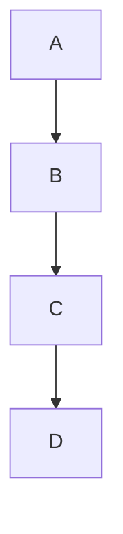
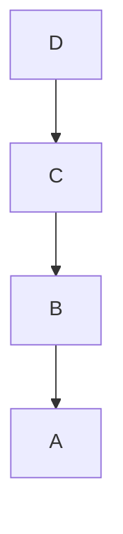

# Technical Interview
## Coding exercise

Reverse the order of nodes in a singly linked list.

Given an original singly linked list A->B->C->D

Reverse it to D->C->B->A;

This coding exercise is very popular among employers. 
Personally, when actively looking for my next project, I get asked this question, at least, once a week.
Keep a solution to this, or a similar coding exercise, in your tool belt.
